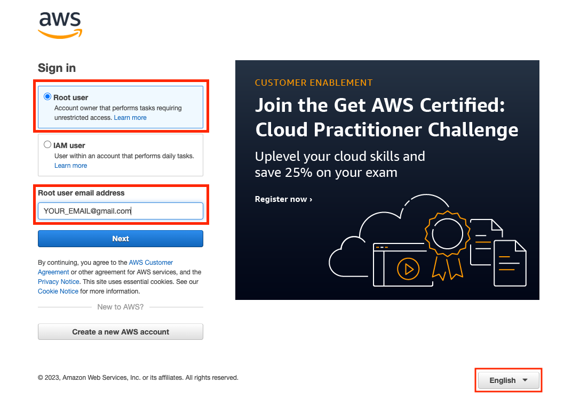
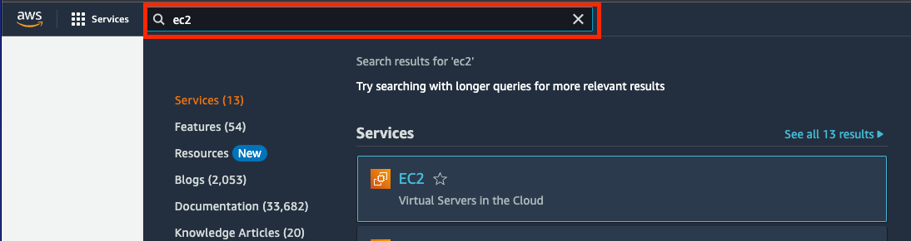
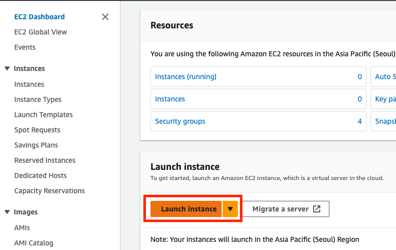
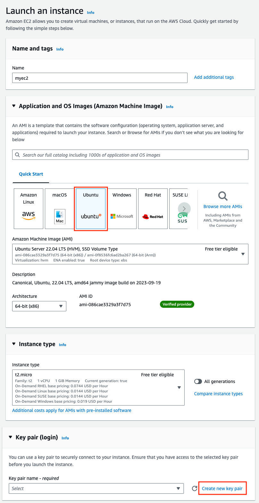
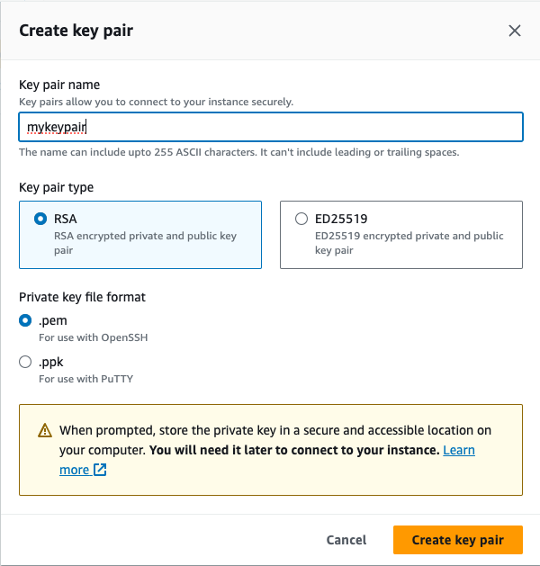
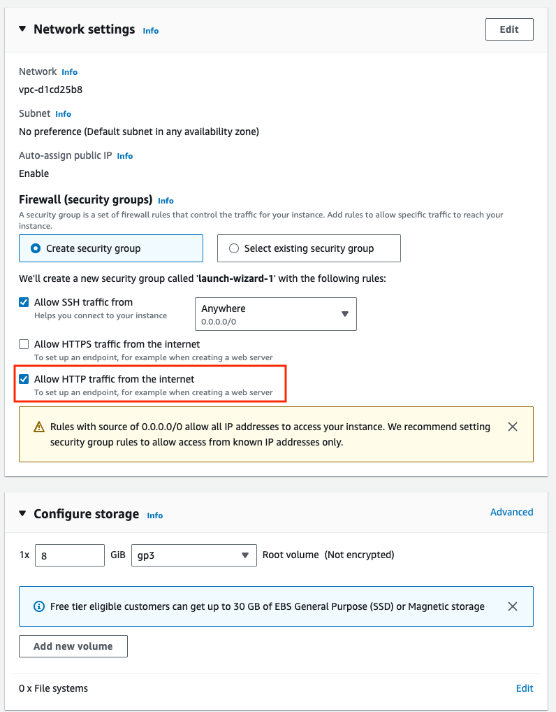
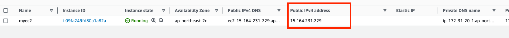
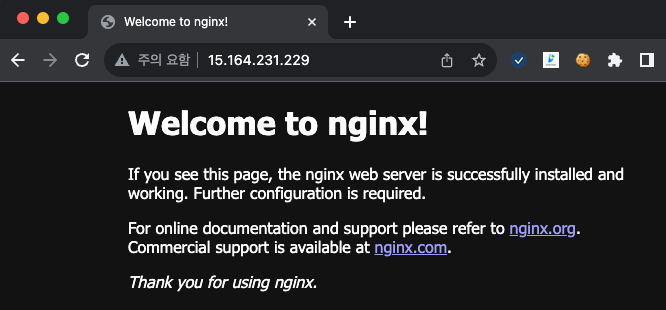

# Hello World, Hello AWS

이번 장의 목표는 처음으로 AWS를 한번 경험해 보는 것입니다. AWS를 사용한다는 의미는 주로 AWS Web console을 말합니다.

처음 사용할 서비스로 EC2라는 서비스를 사용해 볼 것입니다. EC2란 가상의 서버를 의미합니다. 가상서버를 인스턴스(Instance)라고 부르기도 합니다.

### AWS 웹 콘솔 접속

AWS console: https://console.aws.amazon.com



영문을 기준으로 실습이 진행됩니다. `English`로 바꿔주시기 바랍니다.

> [!NOTE] 
 왜 영문으로 설정 하나요? 
 문제 해결 시, 영문으로 작성된 문서가 더 많습니다. 처음부터 영문 인터페이스에 적응하는게 나중에 더 도움이 될 것으로 생각합니다.

### EC2 생성

- 상단 Search 바에 `EC2` 입력, EC2 선택 (앞으로 서비스를 찾을 때, 자주 사용할 것입니다.)
	
- `Launch Instance` 버튼 클릭
	
- Launch an instance
	- Name: `myec2`
	- Application and OS images: `Ubuntu` (나머지는 그대로)
	- Instance type: `t2.micro`
	- Key pair: `Create new key pair`
		- key pair name: `mykeypair`
		- Key pair type: `RSA`
		- Private key file format: `.pem`
		- Create key pair & Download
	- Network settings:
		- `Create security group`
		- Allow SSH traffic from: ✅
		- Allow HTTP traffic from the internet: ✅
	- EBS Volumes Size: 8
	- 오른쪽 `Launch Instance` 버튼 클릭
	- 
	- 
	- 
- EC2 instance 리스트에서 Public IP 확인 (Private IP를 확인하시면 안됩니다.)
	
- EC2 접속
	- `$LOCATION`: key pair 다운로드 받은 위치
	- ID: `ubuntu`
	- `$YOUR_IP`: 각자의 Public IP
	- `Are you sure you want to continue connecting`: `yes`
	```bash
	ssh -i $LOCATION/mykeypair.pem ubuntu@$YOUR_IP
	# The authenticity of host 'xxxx' can't be established.
	# ED25519 key fingerprint is SHA256:xxxx.
	# This key is not known by any other names.
	# Are you sure you want to continue connecting (yes/no/[fingerprint])? yes
	```
- docker 설치 후 NGINX 실행
	```bash
	sudo apt update && sudo apt install -y docker.io
	sudo usermod -aG docker $USER    # docker without sudo
	sudo docker run --rm -p 80:80 nginx
	```
- 웹 브라우저에서 접속
	
	


## 실습 (Optional)


### 1)

nginx를 8080 포트로 매핑 시켜서 8080 포트로 EC2 웹서버에 접근해 보자.

```bash
sudo docker run --rm -p 8080:80 nginx
```

힌트: Security group에 Rule을 추가해야 합니다.


### 2)

EBS의 볼륨 size를 한번 늘려보자. Restart 없이 서버가 실행 중에 볼륨이 늘어나는가?

## 읽을 거리

- [Amazon EC2 만들어보기](https://err-bzz.oopy.io/2a6cc7a9-1c16-49eb-a5b1-b0f9c711b979)
- [AWS를 처음 시작한다면?](https://www.awsstartup.io/get-started)

