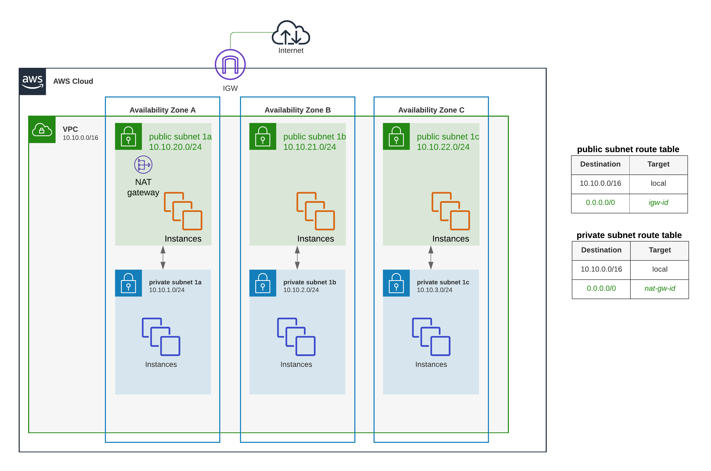
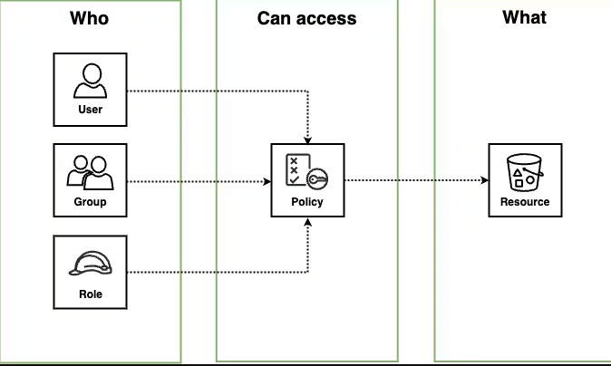
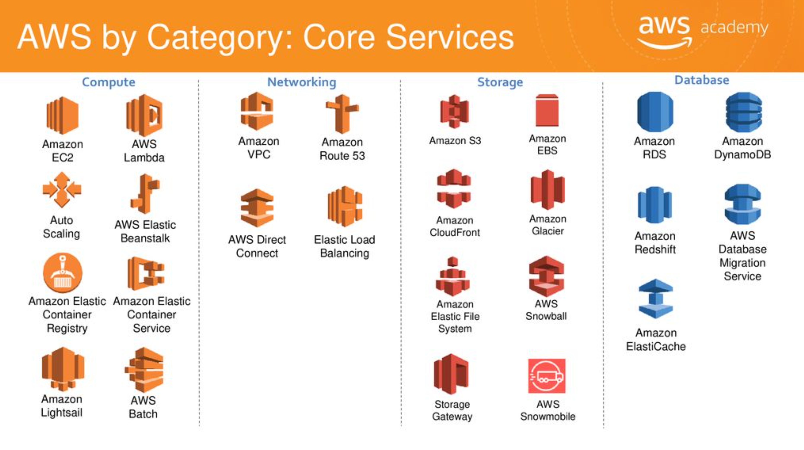

# AWS Basic: Compute, Network, Storage

이번 장의 목표는 AWS에 어떤 서비스들이 있는지 알아보고 중요한 서비스들을 위주로 조금 더 자세히 살펴 보는 것입니다.

컴퓨터를 3가지로 나눈다면 크게 Compute, Network, Storage라 나눌 수 있습니다. AWS에서도 마찬가지로 크게 3가지 개념으로 분류할 수 있습니다.(다만 이것은 AWS의 공식적인 분류는 아니므로 큰 개념을 이해하는데 활용하시기 바랍니다.)

## Compute

- **EC2**: 가상 머신, 가장 기본이 되는 서비스
- ECS: 컨테이너 서비스
- EKS: 쿠버네티스 서비스
- **Lambda**: Serverless function
- LightSail: EC2 lightweight 버전
- Beanstalk: PaaS 형태의 백엔드 개발 프레임워크
- Batch: 배치 job 실행을 목적으로 사용하는 서비스 (내부적으로는 ECS 사용)

## Network

- VPC: 가상의 네트워크 공간
- Subnet: VPC 내의 sub network
- Availability Zone: 가용 구역
- Security Group: 네트워크 보안 설정
- Gateway (Internet, NAT): 외부 인터넷 연결
- Elastic IP: Public 고정 IP
- Route tables: VPC 내, IP route 설정
- ENI (Elastic Network Interface): Network Interface Card (NIC), 특정 IP를 가질 수 있게 하는 장치

VPC detail

> [!NOTE]  
VPC가 중요한 이유: 대부분의 AWS Service들이 VPC 안에 존재하게 된다. VPC 안에 없는 서비스들도 있음. 대표적으로 S3.

[나만의 VPC를 만들어 봅시다.](vpc.md)

## Storage (Database)

- EBS: 블록 스토리지 (하드디스크)
- **RDS**: 관계형 DB 서비스
- Dynamo: NoSQL DB
- ElasticCache: 인 메모리 DB
- **S3**: Object storage 서비스
- **ECR**(Elastic Container Registry): 컨테이너 이미지 저장소

## IAM

Identity and Access Management: 권한관리

- Users: AWS를 접근하는 개별 사용자
- Groups: 여러 User를 모아서 하나의 Group으로 생성
- Roles: AWS 서비스에 부여하는 역할 (약간 패시브 스킬 같음)
- Policies: 특정 서비스를 사용할 수 있는 권한, User, Group이나 Role에 부여한다.

User와 Group은 주로 사람에게, Role은 주로 사람이 아닌 머신이나 서비스에게

AWS Services

## 읽을 거리

- [[AWS] 가장쉽게 VPC 개념잡기](https://medium.com/harrythegreat/aws-%EA%B0%80%EC%9E%A5%EC%89%BD%EA%B2%8C-vpc-%EA%B0%9C%EB%85%90%EC%9E%A1%EA%B8%B0-71eef95a7098)
- [[AWS] VPC의 개념](https://velog.io/@yenicall/AWS-VPC%EC%9D%98-%EA%B0%9C%EB%85%90)
- [개발자들에게 도움이 될 만한 9가지 기본 AWS 서비스](https://www.hanl.tech/blog/helpful-9-amazon-web-services-for-developers/)