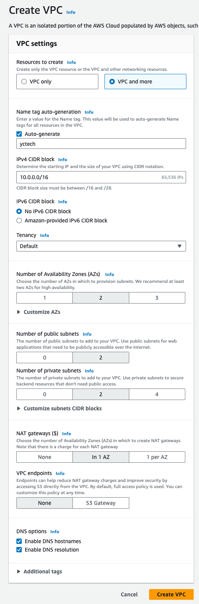

# VPC 생성하기

## Create VPC

- 상단 Search 바에 `VPC` 입력
- `Create VPC` 버튼 클릭
	- `VPC and more`
	- Auto-generate: `yctech`
	- IPv4 CIDR block: `10.0.0.0/16`
	- IPv6 CIDR block: `No IPv6 CIDR block`
	- Tenancy: `Default`
	- Number of Availability Zones: `2`
	- Number of public subnets: `2`
	- Number of private subnets: `2`
	- NAT gateways: `In 1 Az`
	- VPC endpoints: `None`
	- Enable DNS hostnames: ✅
	- Enable DNS resolution: ✅

## 실습 (Optional)

- 새로 만든 VPC 안에 EC2를 생성해 봅시다.
- Public IP와 Private IP가 각각 어떻게 다른지 확인해 봅시다.
	- private IP: hostname -i
	- public IP: `curl https://ifconfig.co`

> [!NOTE]  
Private subnet에 생성하지 마시고 꼭 Public subnet에 생성해 주세요.

> [!IMPORTANT]  
 만약에 Private subnet에 EC2를 생성하였다면 어떻게 접근할 수 있을까요?
