# Containerization

이번 장에서는 Spring Boot 어플리케이션을 컨테이너화 시켜서 EC2 서버 위에 실행해 보면서 다양한 서비스들을 직접 사용해 볼 예정입니다.

## 사용해 볼 AWS 서비스

- RDS: Database service (MySQL, PostgreSQL, AuroraDB)
- ECR: 원격 이미지 저장소 (Private, Public)

## Spring Boot

먼저 미리 세팅해둔 Spring Boot 어플리케이션을 다운 받습니다. [Spring Boot 프로젝트 다운로드](yctech-aws.zip)

아래와 같은 설정으로 만들어진 Spring Boot 어플리케이션입니다.
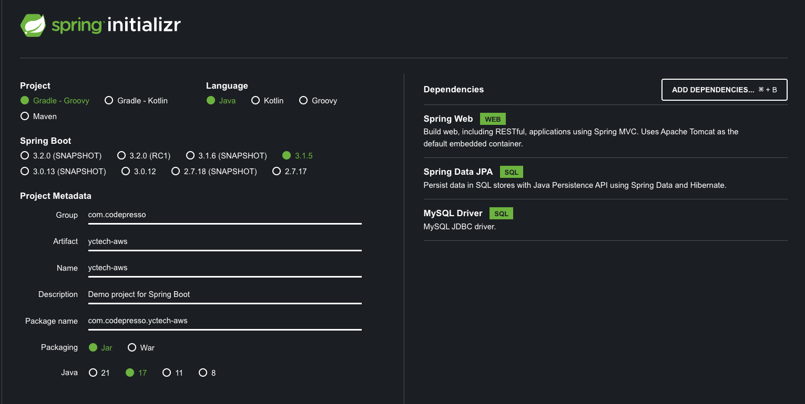

### 구성

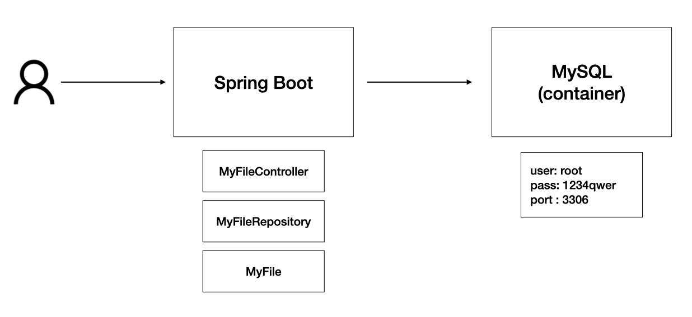


### MySQL 컨테이너

MySQL 컨테이너를 다음과 같이 실행해 줍니다.

- user: root
- pass: 1234qwer
- port: 3306

```bash
# Permission error가 난다면 앞에 sudo를 붙여 줍니다. sudo docker run...
docker run --rm --name mysql -e MYSQL_ROOT_PASSWORD=1234qwer -p 3306:3306 mysql:latest
```

컨테이너 내부로 들어가서 다음과 같이 디비를 설정해 줍니다.

```bash
docker exec -it mysql bash
mysql -p   # password: 1234qwer

create database yctechaws; use yctechaws;
quit;
exit
```

### Spring Boot 구동

```bash
./gradlew bootRun
```

웹 브라우저에서 `localhost:8080` 접속: Hostname만 보일 것이다. 실제로 DB에 값을 넣어봅시다.


```bash
docker exec -it mysql bash
mysql -p   # password: 1234qwer

use yctechaws;
INSERT INTO my_files (name, size, url) VALUES
  ('snow.png', 20, 'https://tinyurl.com/2jwxk6hc'),
  ('sky', 30, 'https://tinyurl.com/46f69fus'),
  ('sun', 40, 'https://tinyurl.com/55cy3s87');
```

다시 웹 브라우저에서 `localhost:8080` 접속 -> 파일 이름과 사이즈, URL 정보를 확인할 수 있습니다.

### RDS 설정

이번에는 로컬 호스트의 도커 컨테이너가 아닌 AWS에서 제공해주는 클라우드 MySQL을 사용해 봅시다.

- 상단 Search 바에 `RSD` 입력
- `Create Database`
  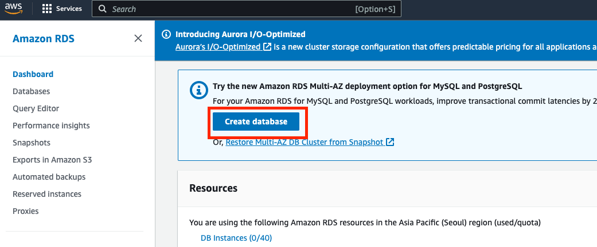
  - Choose a database creation method: `Easy create`
  - Engine type: `MySQL`
  - DB instance size: `Free tier`
  - DB instance identifier: `yctech`
  - Master username: `admin`
  - Master password: `1234qwer`
  - Set up EC2 connection: `myec2`

  


이제 내 로컬 PC에서 접속해 봅시다.

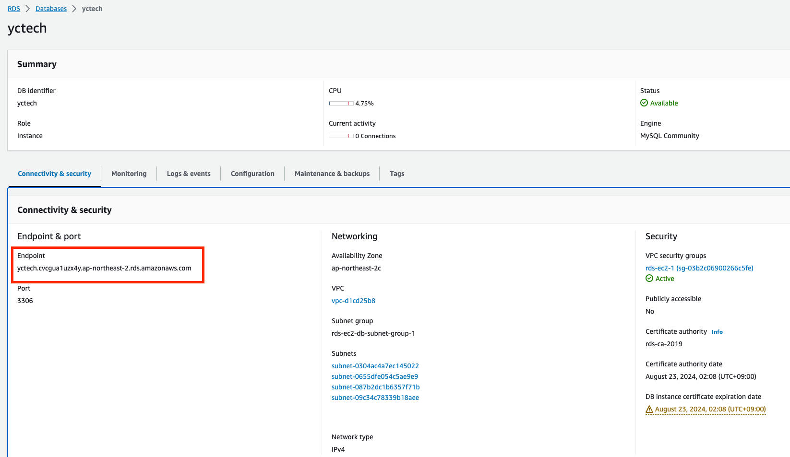

- yctec DB 클릭
- Endpoint 복사
- User: `admin`
- Pass: `1234qwer`

```bash
mysql -h yctech.xxx.ap-northeast-2.rds.amazonaws.com -u admin -p
```

접속이 안될 것이다. 이것은 MySQL security group이 `myec2` instance만 접근할 수 있도록 막아놨기 때문입니다.
그럼 `myec2` 서버에 들어가서 동일하게 접근해 봅시다.


```bash
sudo apt install -y mysql-client
mysql -h yctech.xxx.ap-northeast-2.rds.amazonaws.com -u admin -p

create database yctechaws; use yctechaws;
```

### ECR

이제 본격적으로 컨테이너화 시켜봅시다.

- Elastic Container Registry의 약자
- 도커 컨테이너 이미지 저장소

- 상단 Search 바에 `ECR` 입력
- `Repositories` > `Private` > `Create repository` 클릭
  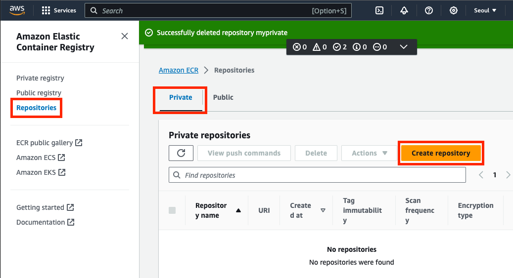
- Create repository
  - Visibility settings: `Private`
  - Repository name: `yctech-aws`
  - `Create repository`
    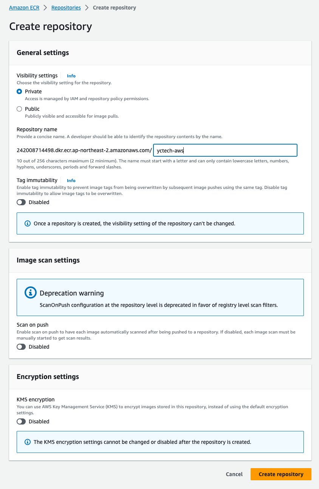
- Repository URI 기억하기: `xxxx.dkr.ecr.ap-northeast-2.amazonaws.com/yctech-aws`

### ECR에 이미지 푸시하기

```bash
docker pull nginx
docker tag nginx xxxx.dkr.ecr.ap-northeast-2.amazonaws.com/yctech-aws
docker push xxxx.dkr.ecr.ap-northeast-2.amazonaws.com/yctech-aws
```

에러가 발생할 것이다. ECR 저장소에 접근하기 위해서 접근권한을 획득해야 합니다. 이를 위해서 `ecr-login` helper와 AWS IAM 설정이 되어 있어야 합니다.

## IAM 권한 설정

### Policy 만들기

- 상단 Search 바에 `IAM` 입력
- 왼쪽 패널에 `Policies` 클릭
- `Create Policy`
- Policy editor에서 `JSON` 선택

```json
{
  "Version": "2012-10-17",
  "Statement": [
    {
      "Sid": "VisualEditor0",
      "Effect": "Allow",
      "Action": [
        "*"
      ],
      "Resource": "*"
    }
  ]
}
```

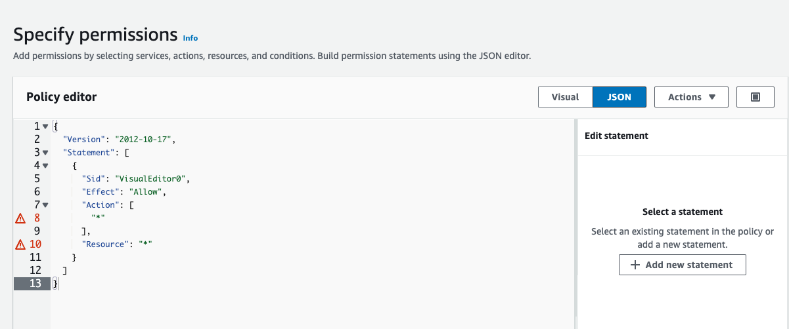

- Next
- Policy name: `yctech-admin`
- Create Policy

> [!NOTE]  
굉장히 권한이 막강한 설정이니 꼭 끝나고 삭제해주시기 바랍니다. (super admin)

### User에 부여하기

- 왼쪽 패널에 `Users` 클릭
- 신규 유저 생성하기: 오른쪽 Create user 버튼 클릭
- User name: `myuser` (Optional checkbox는 클릭하지 않기)
<!-- - Permissions 탭에서 `Add permissions` > `Add permissions` 클릭
  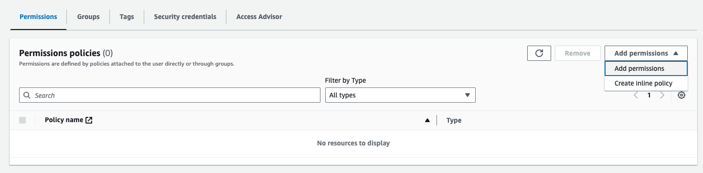 -->
- `Attach policy directly` > `yctech-admin` 검색 후 선택 > `Next` > `Add permissions`
  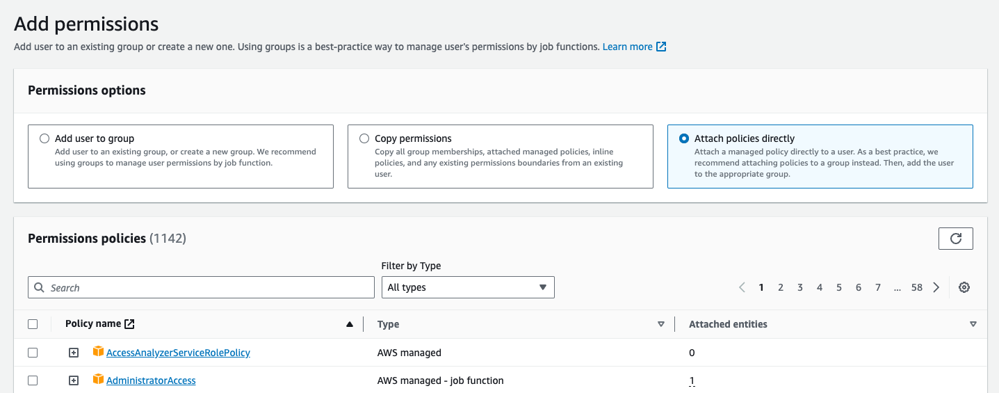

### User의 credential 생성

이제 User로 인증하기 위해서 User의 Access Key와 Secret Key가 필요합니다.

- `Security credentials` 탭에서 > `Create access key`
  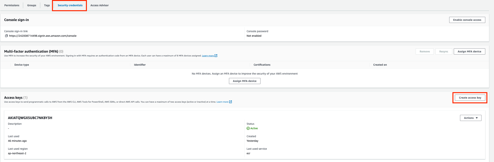
- `Command Line Interface (CLI)` 선택 > 하단에 `Confirmation` 체크 > `Next`
  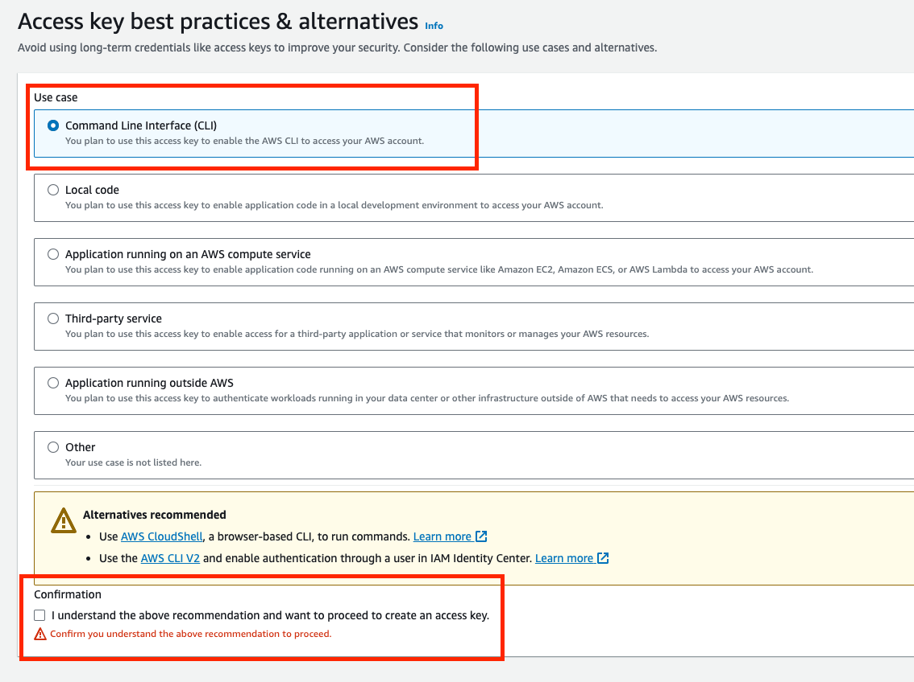
- `Create access key`
- Access key와 Secret key의 값을 꼭 복사하기 바랍니다. (추후에 확인 불가)
  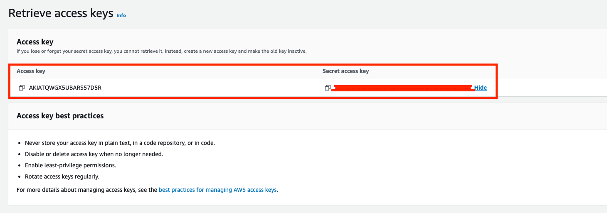

해당 인증키를 가지고 내 로컬 컴퓨터에서 테스트해 봅시다.

```bash
# ecr-login helper 설치
# MacOS
brew install docker-credential-helper-ecr
# WSL
sudo apt install -y amazon-ecr-credential-helper make

# IAM user 설정
aws configure
# AWS Access Key ID:
# AWS Secret Access Key: 
# Default region name: ap-northeast-2
# Default output format [None]:

# ECR 로그인 credential 출력
aws ecr get-login --no-include-email

# ECR 로그인
$(aws ecr get-login --no-include-email)
```

## 컨테이너화

이미지를 생성하기 전에 EC2에서 RDS로 접근할 수 있게 Spring Boot `application.properties`를 수정해 봅시다.

- `spring.datasource.url` 값에 대해서:
  - `jdbc:mysql://localhost:3306/yctechaws?useSSL=false` -> `jdbc:mysql://yctech.cvcgua1uzx4y.ap-northeast-2.rds.amazonaws.com:3306/yctechaws?useSSL=false`
- `spring.datasource.username` 값에 대해서:
  - `root` -> `admin`

### Dockerfile

```Dockerfile
FROM openjdk:17-alpine

ADD build/libs/yctech-aws-0.0.1-SNAPSHOT.jar /
ENTRYPOINT ["java", "-jar", "/yctech-aws-0.0.1-SNAPSHOT.jar"]
```

```Makefile
# Makefile
.PHONY: build
build:
  ./gradlew build
  docker build . -t xxxx.dkr.ecr.ap-northeast-2.amazonaws.com/yctechaws:latest --platform linux/amd64

push: build
  $$(aws ecr get-login --no-include-email)
  docker push xxxx.dkr.ecr.ap-northeast-2.amazonaws.com/yctechaws:latest
```

Makefile을 이용하여 이미지를 만들어 봅시다.

```bash
# 이미지 빌드
make build

# 이미지 업로드
make push
```

### jib

jib은 gradle task를 통해 도커 이미지를 생성할 수 있게 해주는 plugin입니다.

https://github.com/GoogleContainerTools/jib/tree/master

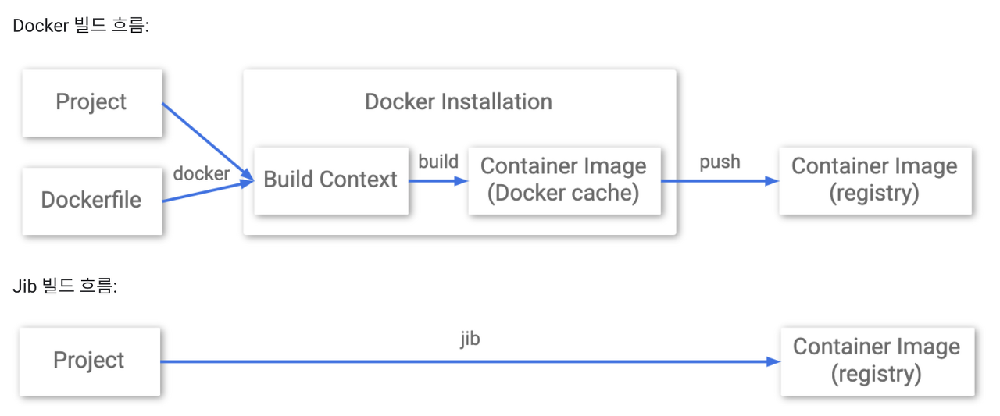

### 설정 방법

```bash
plugins {
  id 'java'
  id 'org.springframework.boot' version '3.1.5'
  id 'io.spring.dependency-management' version '1.1.3'
  id 'com.google.cloud.tools.jib' version '3.4.0'      // <--- plugin 추가
}

group = 'com.codepresso'
version = '0.0.1-SNAPSHOT'

java {
  sourceCompatibility = '17'
}

repositories {
  mavenCentral()
}

dependencies {
  implementation 'org.springframework.boot:spring-boot-starter-data-jpa'
  implementation 'org.springframework.boot:spring-boot-starter-web'
  runtimeOnly 'com.mysql:mysql-connector-j'
  testImplementation 'org.springframework.boot:spring-boot-starter-test'
}

tasks.named('test') {
  useJUnitPlatform()
}


// jib 추가
jib {
  from {
    image = 'openjdk:17-alpine'
  }
  to {
    image = 'xxxx.dkr.ecr.ap-northeast-2.amazonaws.com/yctechaws'
    credHelper = 'ecr-login'
    tags = ['latest']
  }
  container {
    jvmFlags = ['-Xms512m']
    format = 'OCI'
  }
}
```

```bash
./gradlew jib
```


## 컨테이너 실행 on EC2

EC2에 접속하여 다음과 같이 동일하게 실행해 줍니다.

```bash
# ecr-login help 설치
sudo apt update && sudo apt install -y amazon-ecr-credential-helper awscli docker.io
sudo usermod -aG docker ubuntu

# IAM user 설정
aws configure
# AWS Access Key ID:
# AWS Secret Access Key: 
# Default region name: ap-northeast-2
# Default output format [None]:

# ECR 로그인
sudo $(sudo -E aws ecr get-login --no-include-email)

# Spring Boot 이미지 실행
sudo docker run -p 80:8080 xxxx.dkr.ecr.ap-northeast-2.amazonaws.com/yctechaws:latest
```

웹 브라우저에서 Public IP로 접근합니다.

## 실습 (Optional)

GitHub Actions를 이용하여 Spring Boot 어플리케이션을 컨테이너화 해봅시다. `git push`를 했을 때, 자동으로 새로운 컨테이너가 만들어져서 ECR로 업로드가 된다면 성공!

### 힌트

GitHub Actions secret에 다음과 같은 환경변수를 설정하면 aws configure와 동일한 효과를 가집니다.

- `AWS_ACCESS_KEY_ID`
- `AWS_SECRET_ACCESS_KEY`
- `AWS_DEFAULT_REGION`


## 읽을 거리

- [AWS 컨테이너 서비스 훑어보기](https://www.daleseo.com/aws-container-services/)
