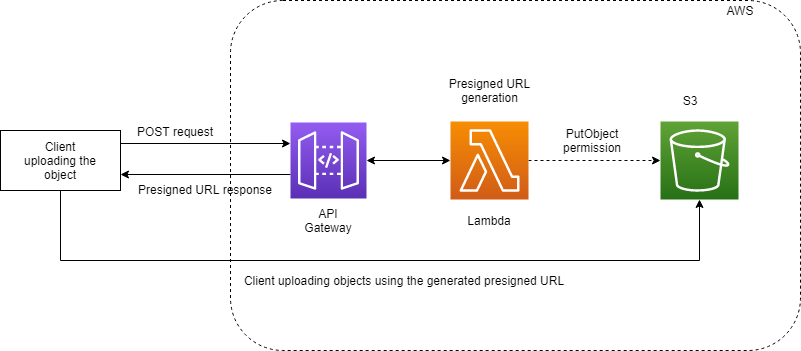
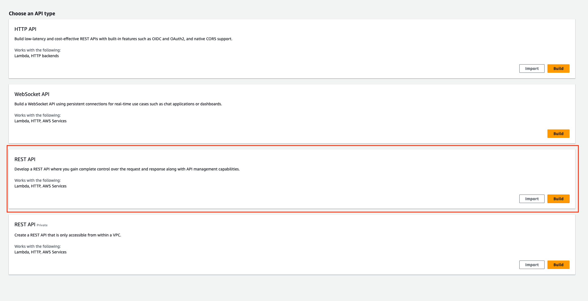
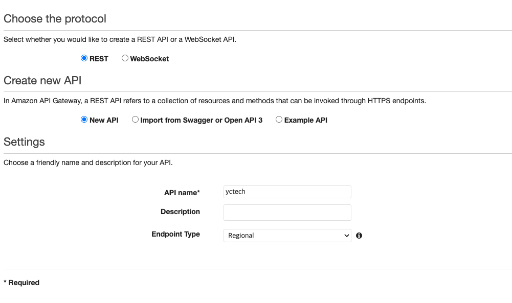
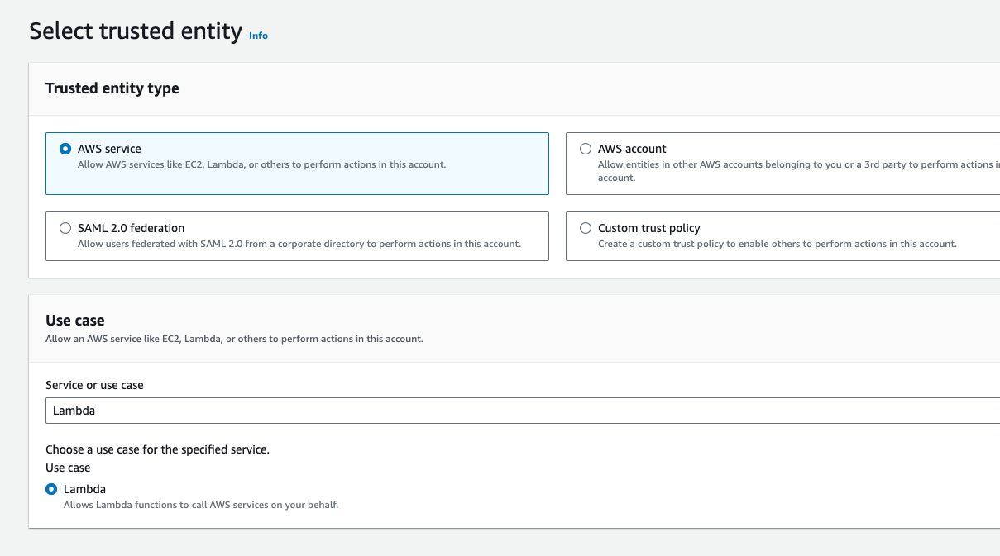
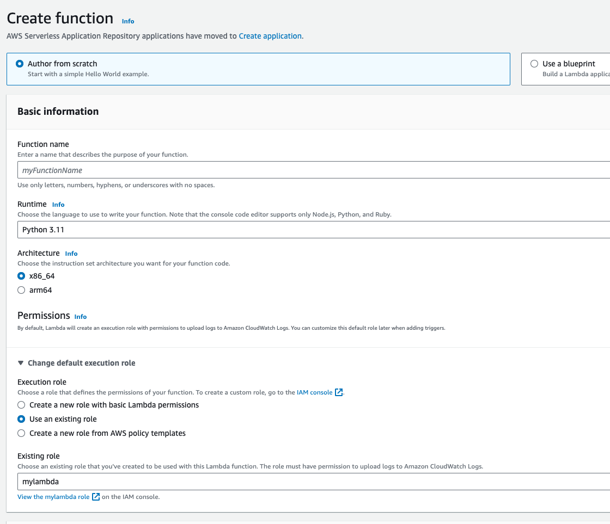
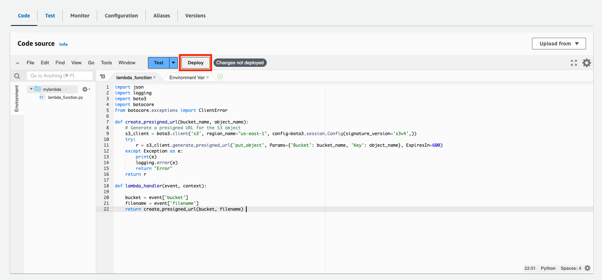
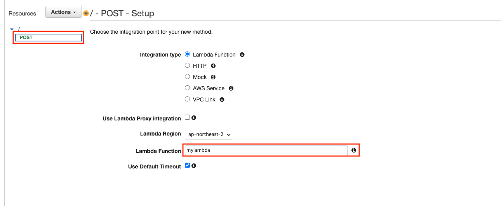
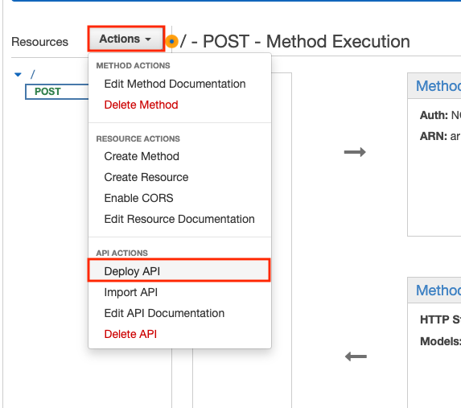
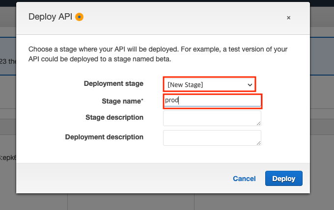
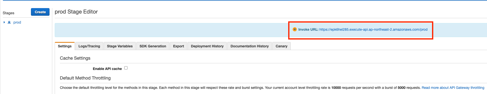

# Serverless Architecture

이번 장에서는 클라우드의 큰 장점/특징 중 하나인 Serverless 아키텍처에 대해서 이해하고 실습해 봅니다.

### Serverless가 왜 중요할까요?

서버가 있다는 말은 해당 서버를 지속적으로 유지/보수/관리해 줘야 한다는 의미 입니다. 서버를 패치하고 보안 업데이트를 하고 서버가 지속적으로 동작하는지 체크해 줘야 합니다.
서버리스를 사용하게 된다면 이 모든 힘든 일은 제거할 수 있습니다.

## 사용해 볼 AWS 서비스

- API Gateway: RESTful API 요청을 받아내는 서비스 (Spring Controller)
- Lambda: 실제 비즈니스 로직을 구현하는 컴퓨팅 컴포넌트 (Spring Service)
- S3: 파일을 저장하는 원격 저장소 (Spring Data, but not DB)

### Serverless 아키텍처를 통해 만들려고 하는 서비스



원래 S3는 credential (Access key, Secret key)가 있어야지만 접근이 가능합니다.
하지만 presigned URL을 획득한다면 credential 없이 파일 업로드, 다운로드가 가능합니다.

1. API Gateway를 통해 Lambda를 RESTful로 호출하여 presigned URL을 획득합니다.
2. 획득한 presigned URL을 이용하여 S3에 파일을 업로드 합니다.

## S3 Object Storage

```bash
# List buckets
aws s3 ls

# Make bucket
aws s3 mb s3://mybucket --region us-east-1

# List in bucket
aws s3 ls s3://mybucket

# upload
aws s3 cp readme.md s3://mybucket/readme.md

# download
aws s3 cp s3://mybucket/readme.md readme.md
```

> [!NOTE]  
꼭 `us-east-1` region에 S3 bucket을 생성할 것: [관련 자료](https://docs.aws.amazon.com/AmazonS3/latest/userguide/UsingRouting.html#TemporaryRedirection)


## Create API Gateway

- 상단 Search 바에 `API Gateway` 입력
- 오른쪽에 `Create API` 버튼 클릭
- REST API `Build` 버튼 클릭
	
- Choose protocal: `REST`
- Create new API: `New API`
- Settings
	- API name: `yctec`
	- Endpoint Type: `Regional`
	

## Create Role for Lambda

- 상단 Search 바에 `IAM` 입력
- 왼쪽 패널에서 `Roles` 클릭
- 오른쪽 `Create Role` 버튼 클릭
	- AWS Service
	- Service: `Lambda`
	
- Permissions policies에서 이전에 만든 `yctech-admin` 검색 후 선택
- Role name: `mylambda-role`

## Create Lambda

- 상단 Search 바에 `lambda` 입력
- 오른쪽 `Create function` 버튼 클릭
	
- `Author from scratch` 선택
- Function name: `mylambda`
- Runtime: `Python 3.11`
- Architecture: `x86_64`
- Chnage default execution role:
	- Use an existing role: `mylambda`
- `Create function` 버튼 클릭

code editor에 다음과 같이 입력

```python
import json
import logging
import boto3
import botocore
from botocore.exceptions import ClientError

def create_presigned_url(bucket_name, object_name):
    # Generate a presigned URL for the S3 object
    s3_client = boto3.client('s3', region_name="us-east-1", config=boto3.session.Config(signature_version='s3v4',))
    try:
        r = s3_client.generate_presigned_url('put_object', Params={'Bucket': bucket_name, 'Key': object_name}, ExpiresIn=600)
    except Exception as e:
        print(e)
        logging.error(e)
        return "Error"
    return r
    
def lambda_handler(event, context):
    
    bucket = event['bucket']
    filename = event['filename']
    return create_presigned_url(bucket, filename) 
```

`Deploy` 버튼 클릭


## Deploy API Gateway

- 상단 Search 바에 `API Gateway` 입력
- `yctech` 선택
- `Actions` > `Create Method`
	
- `POST` > `check` > Lambda Function: `mylambda` > Save
	
- `Actions` > `Deploy API`
	
- Deployment stage: `New Stage` > Stage name: `prod` > `Deploy`
	
- prod Stage Editor에서 Invoke URL값 복사
	

## Request using curl

이제 `curl`을 이용하여 호출해 보도록 합니다.

```bash
curl -d '{"bucket":"$MYBUCKET", "filename": "readme.md"}' https://xxxx.execute-api.ap-northeast-2.amazonaws.com/prod
# https://$MYBUCKET.s3.amazonaws.com/readme.md?xxx

# URL을 꼭 쌍따옴표 안에 넣는다: "https://xx"
curl -v --upload-file readme.md "https://$MYBUCKET.s3.amazonaws.com/xxx"

# 파일이 업로드 되었는지 확인
aws s3 ls s3://$MYBUCKET
```

## 실습 (Optional)

`presigned URL s3 download` Lambda를 한번 만들어 봅시다!
presigned URL을 획득하면 특정 파일을 credential 없이 다운 받을 수 있습니다.

## 읽을 거리

- [서버리스(ServerLess) 개념 정리](https://inpa.tistory.com/entry/WEB-%F0%9F%8C%90-%EC%84%9C%EB%B2%84%EB%A6%AC%EC%8A%A4ServerLess-%EA%B0%9C%EB%85%90-%F0%9F%92%AF-%EC%B4%9D%EC%A0%95%EB%A6%AC-BaaS-FaaS)
- [AWS Lambda + API Gateway로 Serverless API 환경 구성하기](https://velog.io/@seeh_h/AWS-Lambda-API-Gateway%EB%A1%9C-API-%EB%A7%8C%EB%93%A4%EA%B8%B0)