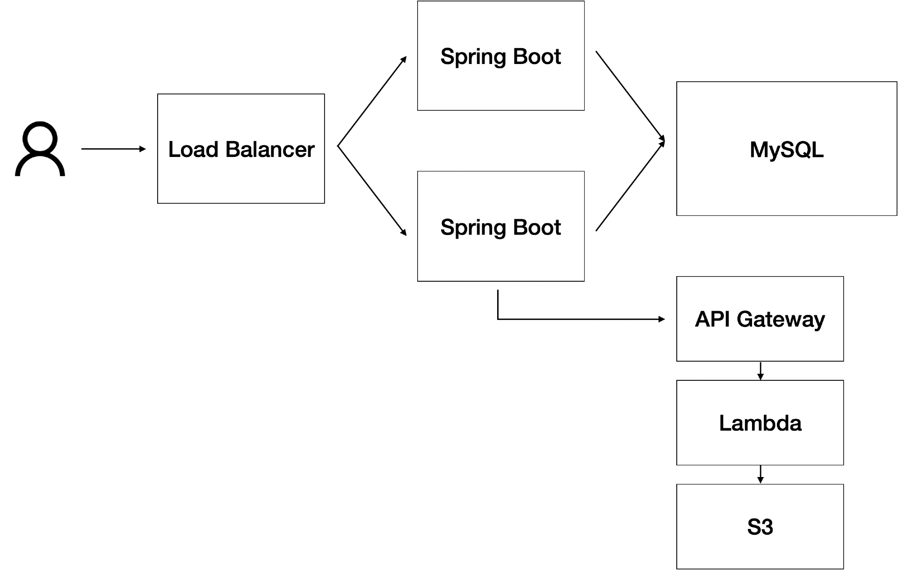
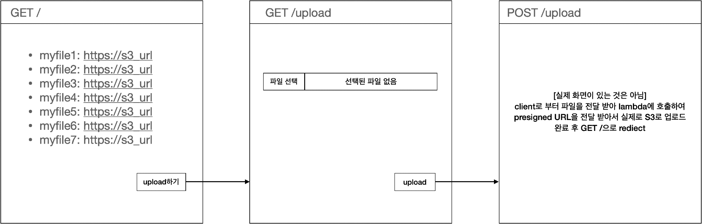

# Project

## Goal

Spring Boot 어플리케이션으로 파일을 업로드하면 API Gateway를 호출하여 S3에 이미지가 업로드되게 해 봅시다.

## 웹 화면

### GET /

현재까지 업로드 되어 있는 파일을 전부 리스팅합니다.

### GET /upload

upload 화면 출력

File selector가 있어서 파일을 선택하고 `upload` 버튼을 누릅니다.

### POST /upload

`upload` 버튼을 누르게 되면 해당 Method가 호출된다. 실제 파일을 업로드하고 GET / 으로 rediect 됩니다.

