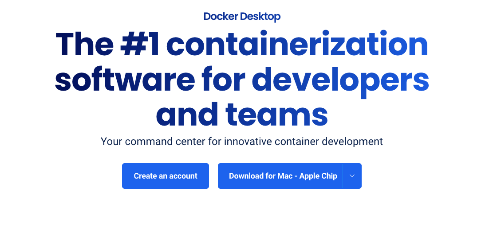
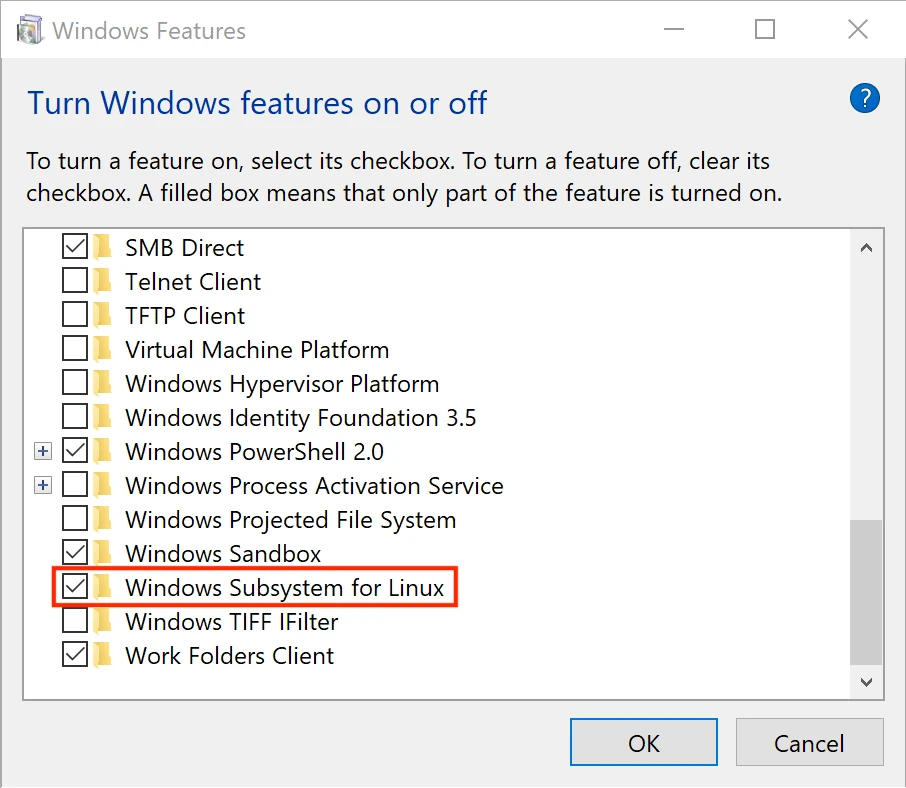
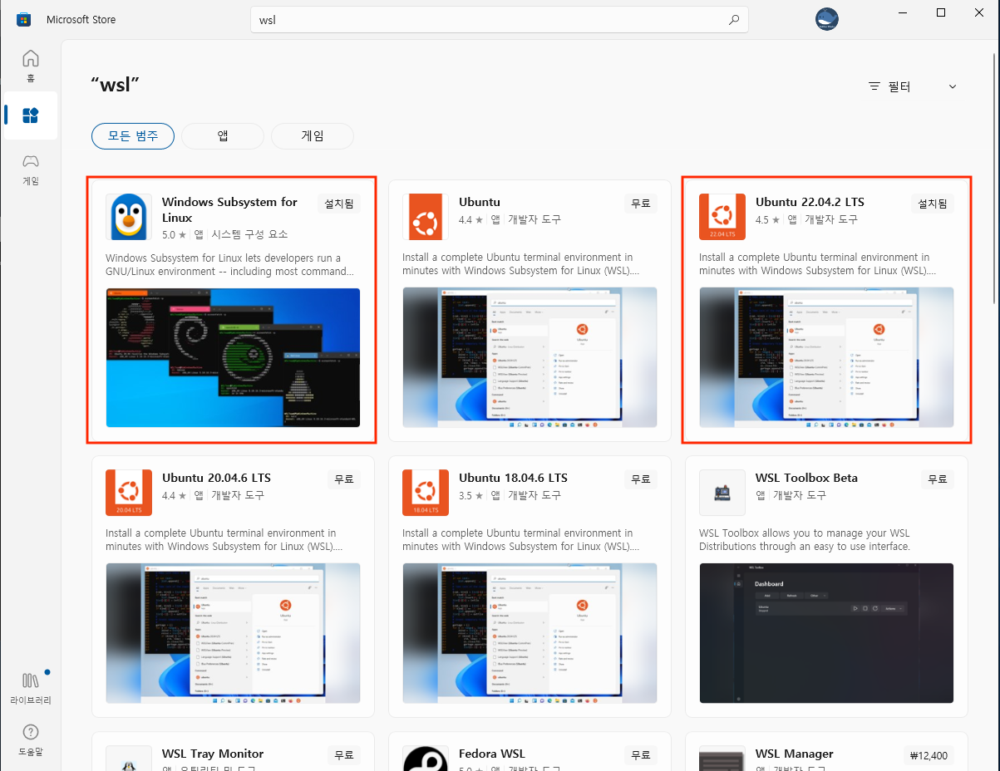
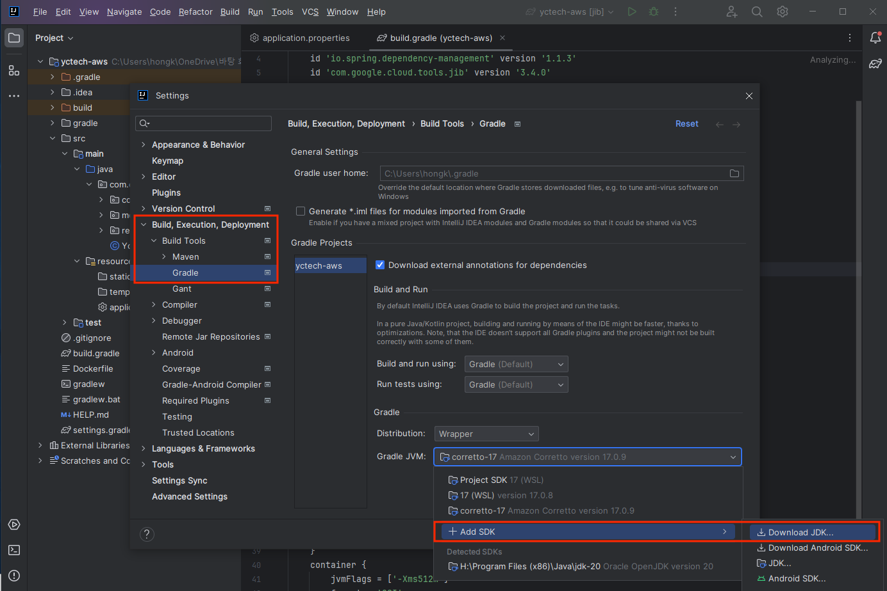
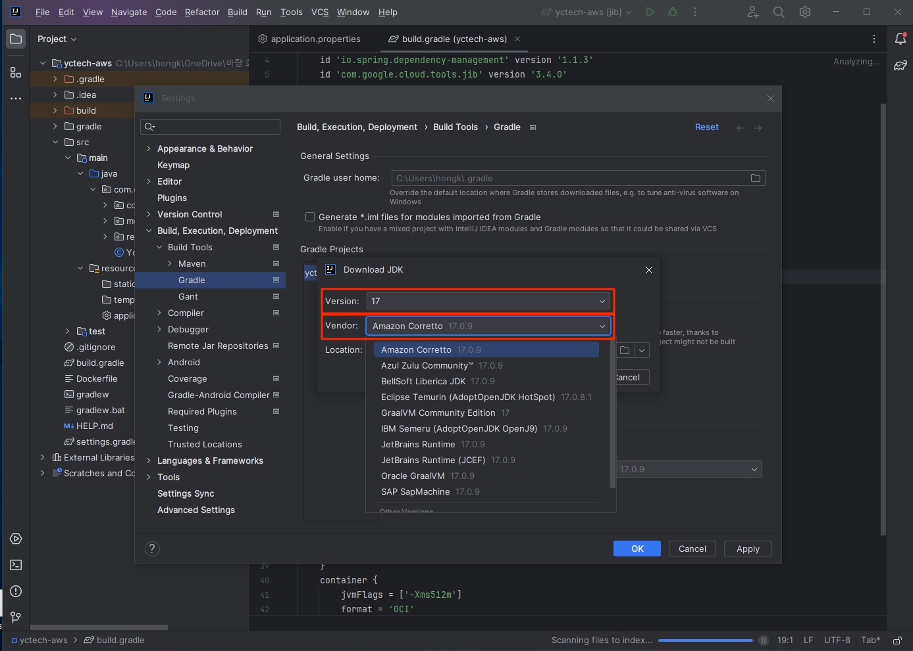

# 사전 설치

- [MacOS](#macos)
- [Windows](#windows)

## MacOS 

MacOS에서 Terminal을 엽니다.

### Xcode, brew 설치

Xcode Command Line Tools와 homebrew가 설치되어 있지 않다면 먼저 다음과 같이 설치해 주세요.

```bash
xcode-select --install
/bin/bash -c "$(curl -fsSL https://raw.githubusercontent.com/Homebrew/install/HEAD/install.sh)"
```

### Java 17

```bash
brew update && brew install openjdk@17
echo 'export PATH="/opt/homebrew/opt/openjdk@17/bin:$PATH"' >> ~/.zshrc
```

### Java IDE (IntelliJ)

- 다음 URL 접속: [https://www.jetbrains.com/idea/download](https://www.jetbrains.com/idea/download/)
- `IntelliJ IDEA Community Edition` 선택 (주의: Ultimate 아래에 있음)
	

### awscli

```bash
brew install awscli
```

### Docker Desktop

- 다음 URL 접속: [https://www.docker.com/products/docker-desktop](https://www.docker.com/products/docker-desktop/)
- Platform에 맞게 선택
	

### 마지막

```bash
. ~/.zshrc
```

## Windows

윈도우에서 개발하려면 먼저 WSL 설치가 필요합니다. 윈도우에서 리눅스를 사용할 수 있게 해주는 프로그램입니다.

### WSL (Windows Subsystem for Linux) 설치

https://learn.microsoft.com/ko-kr/windows/wsl/install

- 프로그램 추가/삭제 열기 > 윈도우 기능 켜기 끄기 > `Windows Subsystem for Linux` 클릭 > 확인
	
- 시작메뉴에서 Windows Store 검색
- wsl 검색
- Windows Subsystem for Linux 설치
- Ubuntu 22.04 설치
	
- Windows키+R 입력 > `bash` 입력
	```bash
	sudo apt upgrade && sudo apt update
	```

### Java IDE (IntelliJ)

간단한 Spring Boot App 개발을 위한 IDE를 설치합니다.

- 다음 URL 접속: [https://www.jetbrains.com/idea/download](https://www.jetbrains.com/idea/download/)
- `IntelliJ IDEA Community Edition` 선택 (주의: Ultimate 아래에 있음)
	

### Java

IntelliJ에서 자바 17을 설치합니다.
 
- Settings > Build, Execution, Deployment > Gradle > Gradle JVM > Add SDK > Download SDK


- Version: `17` > Vendor: `Amazon Corretto`



wsl에 다음과 같이 설치를 해줍니다.

```bash
# in WSL
sudo apt install openjdk-17-jdk
```

### awscli

wsl에 다음과 같이 설치를 해줍니다.

```bash
sudo apt install -y awscli
```

### Docker Desktop

- 다음 URL 접속: [https://www.docker.com/products/docker-desktop](https://www.docker.com/products/docker-desktop/)
- Platform에 맞게 선택
	

```bash
# Run docker without sudo
sudo usermod -aG docker $USER
```
